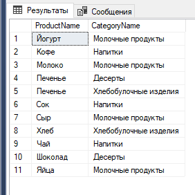
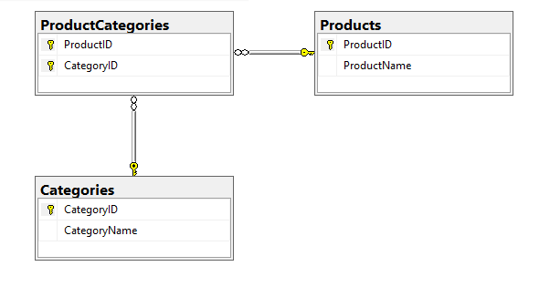

### Ответ на данную задачу

```sql
USE TestDatabase;

BEGIN TRANSACTION

SELECT 
    p.ProductName,
    c.CategoryName
FROM 
    Products AS p
LEFT JOIN 
    ProductCategories AS pc ON p.ProductID = pc.ProductID
LEFT JOIN 
    Categories AS c ON pc.CategoryID = c.CategoryID
ORDER BY 
    p.ProductName, c.CategoryName;

COMMIT TRANSACTION;
```
### Результат



# Обзор на базу данных



Она была создана следующим TSQL-запром:

```sql

CREATE DATABASE TestDatabase;

USE TestDatabase;

BEGIN TRANSACTION

CREATE TABLE Products (
    ProductID INT PRIMARY KEY IDENTITY(1,1),
    ProductName VARCHAR(100) NOT NULL
);

CREATE TABLE Categories (
    CategoryID INT PRIMARY KEY IDENTITY(1,1),
    CategoryName VARCHAR(40) NOT NULL
);

CREATE TABLE ProductCategories (
    ProductID INT NOT NULL,
    CategoryID INT NOT NULL,
    PRIMARY KEY (ProductID, CategoryID),
    FOREIGN KEY (ProductID) REFERENCES Products(ProductID),
    FOREIGN KEY (CategoryID) REFERENCES Categories(CategoryID)
);

COMMIT TRANSACTION
```

Все файлы искать тут: [ссылка на файлы](https://github.com/Ivanplat/MindboxSecondTestTask/tree/main/SQL)